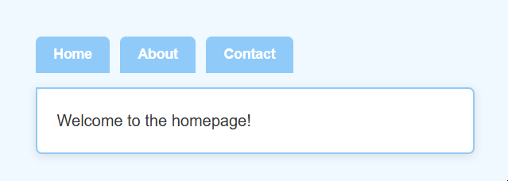
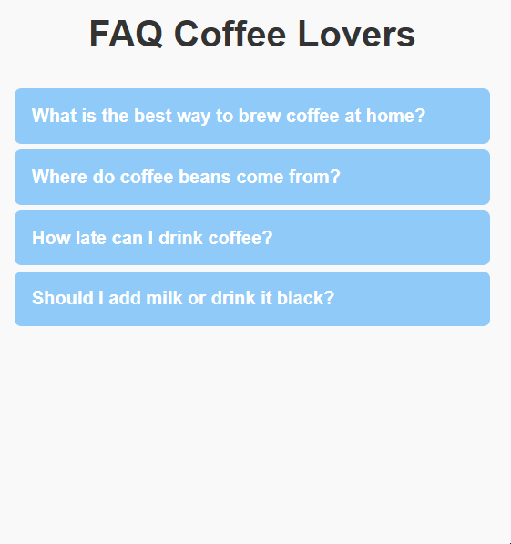
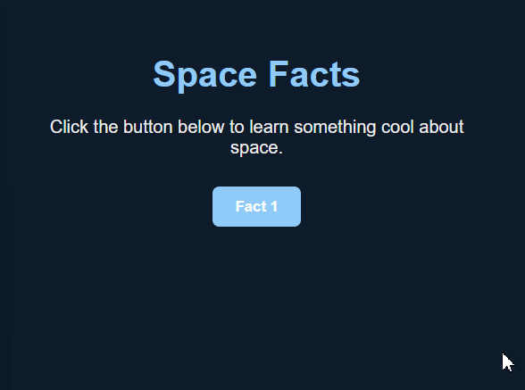
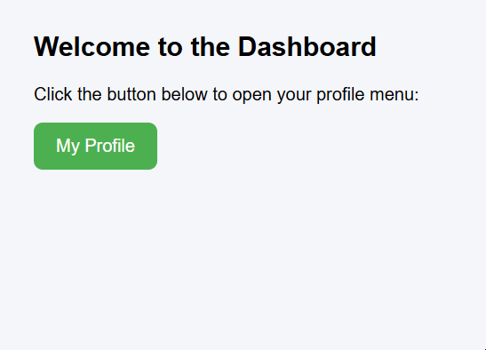

# JavaScript in Action:

## Interactivity/UI Components:

### Tabs:

Tabs let users switch between <i>different pieces on content without leaving the page</i>.

#### Key Points:

1. We use the **display property to `none` / `block`** so that we can show or hide the elements.
2. When the user clicks a tab, we **call the function** and pass the tab's ID.
3. Inside the function, we use the `querySelectorAll()` + `forEach()` loop to select all elements and hide all tab contents.
4. FInally, we **show the one that matches the ID**.

#### Basic Syntax:

```html
<div class="tabs">
  <button class="tab" onclick="openTab('services')">Services</button>
  <button class="tab" onclick="openTab('contact')">Contact</button>
</div>

<div id="services" class="tab-content">Our services are listed here.</div>
<div id="contact" class="tab-content" style="display:none;">Contact us at contact@example.com.</div>

<script>
  function openTab(tabId) {
    // Hide all tab contents
    document.querySelectorAll('.tab-content').forEach(el => el.style.display = 'none');
    // Show the selected tab
    document.getElementById(tabId).style.display = 'block';
  }
</script>
```

##### Breakdown:

To make this tab system function to work, the JavaScript follows a simple **"Clear and Show"** logic.

**1. The Trigger (Event Handling):** The attribute `onClick` which is located inside the `<button>` tags lead to the function called `openTab('id')` that is defined in the `<script>` tag (this contains JavaScript code). This will trigger when the user clicks on the button.

**2. The Reset (Hiding Everything):** Once the function runs, the line `document.querySelectorAll('.tab-content').forEach(...)` will locate every element with the class `tab-content` and sets its CSS to `display: none`.

**3. The Activation (Targeting the ID):** Within the line `document.getElementById(tabId)`, the program will use the **ID** received in step 1 to locate the specific `<div>` the user wants to view.

**4. The Display (Updating CSS):** Finally, once the `.style.display = 'block'` value is set to the overridden element, changing it from `none` (hidden) to `block` (visible), the content will instantly appear on the screen, ending the script execution.

#### Example of Usage:

##### HTML:

```html
<!DOCTYPE html>
<html lang="en">
<head>
    <meta charset="UTF-8">
    <meta name="viewport" content="width=device-width, initial-scale=1">
    <title>Simple Tabs Example</title>
    <link rel="stylesheet" href="styles.css">
    <script src="main.js" defer></script>
</head>
<body>
    <div class="tabs">
        <!-- Each button calls the function and passes the tab's ID -->
        <button class="tab" onclick="openTab('home')">Home</button>
        <button class="tab" onclick="openTab('about')">About</button>
        <button class="tab" onclick="openTab('contact')">Contact</button>
    </div>

    <!-- By default, only "Home" is visible -->
    <div id="home" class="tab-content">Welcome to the homepage!</div>
    <div id="about" class="tab-content">Learn more about us here.</div>
    <div id="contact" class="tab-content">Get in touch with us.</div>
</body>
</html>
```

##### CSS:

```css
body {
    font-family: Arial, sans-serif;
    background: #f0f8ff; /* very light blue background */
    padding: 30px;
    color: #333;
}

.tabs {
    display: flex;
    gap: 10px;
    margin-bottom: 15px;
}

.tab {
    padding: 10px 18px;
    border: none;
    background: #90caf9; /* light blue */
    color: #fff;
    border-radius: 6px 6px 0 0;
    cursor: pointer;
    font-size: 14px;
    font-weight: bold;
    transition: background 0.2s ease, transform 0.1s ease;
}

#home { display: block; }
#about { display: none; }
#contact { display: none; }

.tab:hover {
    background: #64b5f6; /* brighter blue on hover */
}

.tab:active {
    transform: translateY(1px);
}

.tab:focus {
    outline: none;
    box-shadow: 0 0 0 3px rgba(33, 150, 243, 0.4);
}

.tab-content {
    background: #ffffff;
    border: 2px solid #90caf9;
    border-radius: 0 6px 6px 6px;
    padding: 20px;
    line-height: 1.5;
    box-shadow: 0 2px 8px rgba(0,0,0,0.1);
}
```

##### JavaScript:

```js
const doc = document;

function openTab(tabId) {
    doc.querySelectorAll('.tab-content').forEach(element => {
        element.style.display = 'none';
    });
    document.getElementById(tabId).style.display = 'block';
}
```

##### Result:



### Accordion (expand/collapse):

An **accordion** is a UI component that lets you expand and collapse sections of content. It's often used for FAQs (click a question → show the answer, click again → hide it).
The idea is simple: When you click a header, JavaScript toggles the visibility of the content below.

#### Key Point:

1. We have a **button** and a **content element** that is hidden by default (`display: none`).
2. Clicking the button **triggers the function** and passes the ID of the element that should open.
3. Inside the function:
    - If the element is already showing (`display: block`), we **hide it** (`display: none`).
    - Else, **we show it** (`display: block`).

#### Basic Syntax:

```html
<button onclick="toggle('p1')">Question 1</button>
<div id="p1" style="display:none;">Answer 1</div>

<script>
  function toggle(id) {
    const element = document.getElementById(id); // Obtain the element by ID
    if (element.style.display === "block") { // If the display is set to "block", define it to "none"
      element.style.display = "none";
    } else { // Otherwise, we set it to "block"
      element.style.display = "block";
    }
  }
</script>
```

#### Example of Usage:

##### HTML:

```html
<!DOCTYPE html>
<html lang="en">
<head>
  <meta charset="UTF-8">
  <meta name="viewport" content="width=device-width, initial-scale=1">
  <title>FAQ Accordion</title>
  <link rel="stylesheet" href="style.css">
</head>
<body>

  <h1>FAQ Coffee Lovers</h1>

  <button class="accordion" onclick="togglePanel('q1')">What is the best way to brew coffee at home?</button>
  <div id="q1" class="panel">
    The French press and pour-over methods are popular for making rich, flavorful coffee at home.
  </div>

  <button class="accordion" onclick="togglePanel('q2')">Where do coffee beans come from?</button>
  <div id="q2" class="panel">
    Most coffee beans are grown in countries around the equator, such as Brazil, Ethiopia, and Colombia.
  </div>

  <button class="accordion" onclick="togglePanel('q3')">How late can I drink coffee?</button>
  <div id="q3" class="panel">
    It's best to avoid coffee 6 hours before bedtime, since caffeine can affect your sleep.
  </div>

  <button class="accordion" onclick="togglePanel('q4')">Should I add milk or drink it black?</button>
  <div id="q4" class="panel">
    It depends on your taste! Black coffee has stronger flavor, while milk softens the bitterness.
  </div>
  <script src="script.js"></script>
</body>
</html>
```

##### CSS:

```css
body {
  font-family: Arial, sans-serif;
  background: #f9f9f9;
  padding: 40px;
  color: #333;
}

h1 {
  text-align: center;
  margin-bottom: 30px;
}

.accordion {
  background: #90caf9;
  color: #fff;
  cursor: pointer;
  padding: 15px;
  width: 100%;
  border: none;
  text-align: left;
  outline: none;
  margin-bottom: 5px;
  border-radius: 6px;
  font-size: 16px;
  font-weight: bold;
  transition: background 0.2s ease;
}

.accordion:hover {
  background: #64b5f6;
}

.panel {
  padding: 15px;
  border: 1px solid #90caf9;
  border-radius: 6px;
  margin-bottom: 10px;
  background: #ffffff;
  display: none; /* hidden by default */
}
```

##### JavaScript:

```js
function togglePanel(tabId) {
  const elem = document.getElementById(tabId);
  if (elem.style.display === "block") elem.style.display = "none";
  else elem.style.display = "block";
}
```

##### Result:



### Modal (open/close):

A **modal** is a small window that appears "on top" of the page to <i>grab the user's attention</i>. It's often used ofter login forms, notifications, or confirmations.

#### Key Points:

1. The modal is **hidden by default (`display: none`).
2. Clicking the **"Open" button (x)** runs the `openModal()` function → sets `display: block`.
3. Inside the modal, the **close button (x)** runs the `closeModal()` function → sets `display: none`.
4. Often you can also make it close by clicking **outside the modal** (on the dark overlay).

#### Basic Syntax:

```html
<!-- Button to open modal -->
<button onclick="openModal()">Open Modal</button>

<!-- Modal overlay + content -->
<div id="overlay" style="display:none;">
  <div class="modal">
    <span onclick="closeModal()">×</span>
    <p>This is a modal window.</p>
  </div>
</div>

<script>
  function openModal() {
    document.getElementById("overlay").style.display = "block";
  }
  function closeModal() {
    document.getElementById("overlay").style.display = "none";
  }
</script>
```

#### Example of Usage:

##### HTML:

```html
<!DOCTYPE html>
<html lang="en">
<head>
  <meta charset="UTF-8">
  <meta name="viewport" content="width=device-width, initial-scale=1">
  <title>Space Facts – Modal Example</title>
  <link rel="stylesheet" href="style.css">
</head>
<body>

  <h1>Space Facts</h1>
  <p>Click the button below to learn something cool about space.</p>

  <!-- Buttons that open modals -->
  <button onclick="openModal('fact')">Fact 1</button>

  <!-- Overlay + Modal Content -->
  <div id="overlay" class="overlay" onclick="closeModal()">
    <div id="fact" class="modal">
      <span class="close-btn" onclick="closeModal()">×</span>
      <h2>Shooting Stars</h2>
      <p>Shooting stars are actually tiny meteors burning up as they enter Earth’s atmosphere.</p>
    </div>
  </div>

  <script src="script.js"></script>
</body>
</html>
```

#### CSS:

```css
body {
  font-family: Arial, sans-serif;
  background: #0d1b2a;
  color: #eee;
  text-align: center;
  padding: 40px;
}

h1 {
  margin-bottom: 20px;
  color: #90caf9;
}

button {
  padding: 10px 20px;
  margin: 10px;
  border: none;
  border-radius: 6px;
  background: #90caf9;
  color: #fff;
  font-weight: bold;
  cursor: pointer;
  transition: background 0.2s ease;
}

button:hover {
  background: #64b5f6;
}

.overlay {
  position: fixed;
  top: 0; left: 0;
  width: 100%; height: 100%;
  background: rgba(0, 0, 0, 0.7);
  display: none;
}

.modal {
  background: #fff;
  color: #333;
  padding: 20px;
  margin: 100px auto;
  width: 350px;
  border-radius: 8px;
  box-shadow: 0 2px 8px rgba(0,0,0,0.3);
  display: none; /* the modal hidden by default */
}

.close-btn {
  float: right;
  cursor: pointer;
  font-size: 20px;
  color: #888;
}

.close-btn:hover {
  color: #000;
}
```

##### JavaScript:

```js
function openModal(modalId) {
  // Show the overlay
  document.getElementById("overlay").style.display = "block";
  
  // Show the modal
  document.getElementById(modalId).style.display = "block";
}

function closeModal() {
  document.getElementById("overlay").style.display = "none";
}
```

##### Result:



### Dropdown:

The dropdown component is a common UI element that reveals additional content when clicked.

#### Basic Syntax:

Create the HTML structure for the dropdown:

```html
<div class="dropdown">
  <button class="dropdown-toggle">Select an option</button>
  <div class="dropdown-menu">
    <a href="#">Option 1</a>
    <a href="#">Option 2</a>
    <a href="#">Option 3</a>
  </div>
</div>
```

Next, add some basic CSS to style the dropdown.

```css
.dropdown {
  position: relative;
  display: inline-block;
}
.dropdown-menu {
  display: none;
  position: absolute;
  background-color: #f9f9f9;
  z-index: 1;
}
.show {
  display: block;
}
```

And finally, insert some JavaScript to toggle the dropdown menu:

```js
const dropdownToggle = document.querySelector('.dropdown-toggle');
const dropdownMenu = document.querySelector('.dropdown-menu');

dropdownToggle.addEventListener('click', function() {
  dropdownMenu.classList.toggle('show');
});
```

##### Breakdown:

**1. Selecting the Elements:** The `const  dropdownToggle` finds the clickable element (likely a button or a link) with the class `.dropdown-toggle`. Then the other constant variable called `dropdownMenu` finds the actual list or container with the class `.dropdown-menu`, which you would want to reveal.

**2. The Event Listener:** `addEventListener('click', ...)` will tell the browser to "listen" for a click on the toggle button, where every time a user clicks it, the code inside the `function()` would be executed!

**3. The Toggle Logic:** The function inserted inside the `addEventListener()` function is responsible for the actions of the script. If the menu does not have the class `show`, it adds it, otherwise, it removes it.

So when the button is clicked, the JavaScript **adds or removes the 'show' class**, which controls the visibility of the dropdown menu.

#### Example of Usage:

##### HTML:

```html
<!DOCTYPE html>
<html lang="en">
<head>
  <meta charset="UTF-8">
  <meta name="viewport" content="width=device-width, initial-scale=1">
  <title>Dropdown Challenge</title>
  <link rel="stylesheet" href="style.css">
  <script src="script.js" defer></script>
</head>
<body>

  <h2>Welcome to the Dashboard</h2>
  <p>Click the button below to open your profile menu:</p>

  <div id="profileDropdown" class="dropdown">
    <button class="dropdown-toggle">
      My Profile
    </button>
    <div class="dropdown-menu">
      <a href="#">View Profile</a>
      <a href="#">Settings</a>
      <a href="#">Logout</a>
    </div>
  </div>

</body>
</html>
```

##### CSS:

```css
body {
      font-family: Arial, sans-serif;
      background: #f4f6f9;
      margin: 40px;
    }

.dropdown {
      position: relative;
      display: inline-block;
    }

.dropdown-toggle {
      background-color: #4CAF50;
      color: white;
      padding: 12px 20px;
      font-size: 16px;
      border: none;
      border-radius: 8px;
      cursor: pointer;
      transition: background 0.3s ease;
    }

.dropdown-toggle:hover {
      background-color: #45a049;
    }

.dropdown-menu {
      display: none;
      position: absolute;
      top: 110%;
      right: -50%;
      background-color: #fff;
      border-radius: 8px;
      overflow: hidden;
      min-width: 180px;
      box-shadow: 0px 8px 16px rgba(0,0,0,0.2);
      z-index: 1;
    }

.dropdown-menu a {
      color: #333;
      padding: 12px 16px;
      text-decoration: none;
      display: block;
      transition: background 0.3s ease;
    }

.dropdown-menu a:hover {
      background-color: #f1f1f1;
    }

.dropdown-menu a.logout {
      color: #d9534f;
      font-weight: bold;
    }

.show {
      display: block;
    }
```

##### JavaScript:

```js
const dropdownToggle = document.querySelector('.dropdown-toggle');
const dropdownMenu = document.querySelector('.dropdown-menu');

dropdownToggle.addEventListener('click', function() {
  dropdownMenu.classList.toggle('show');
});
```

##### Result:

