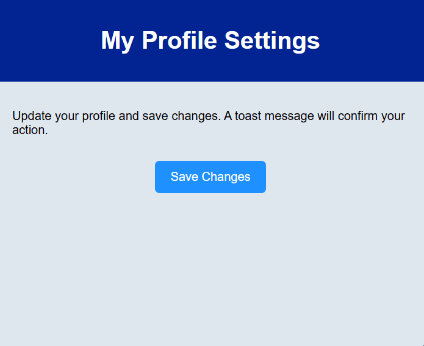
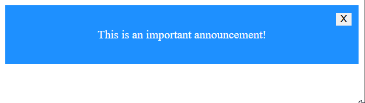
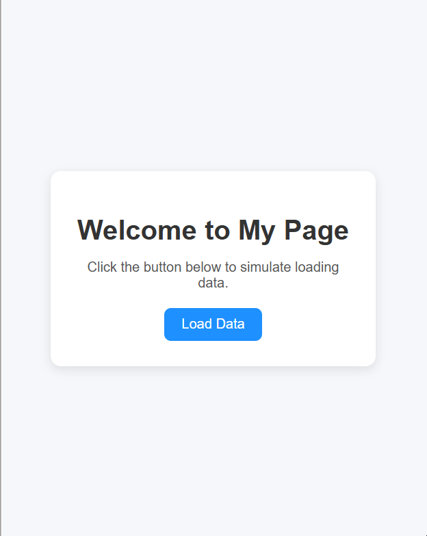
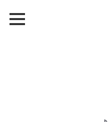
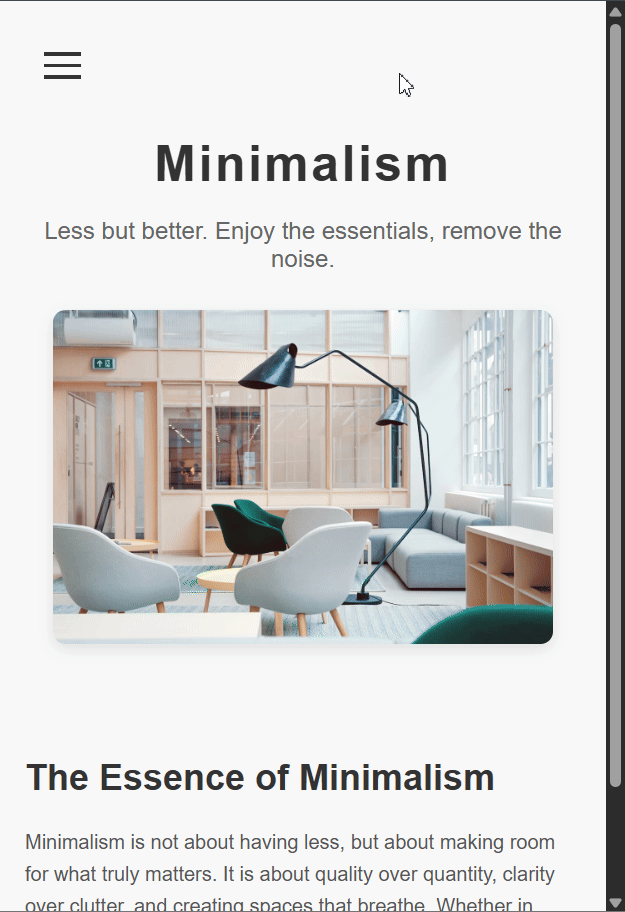
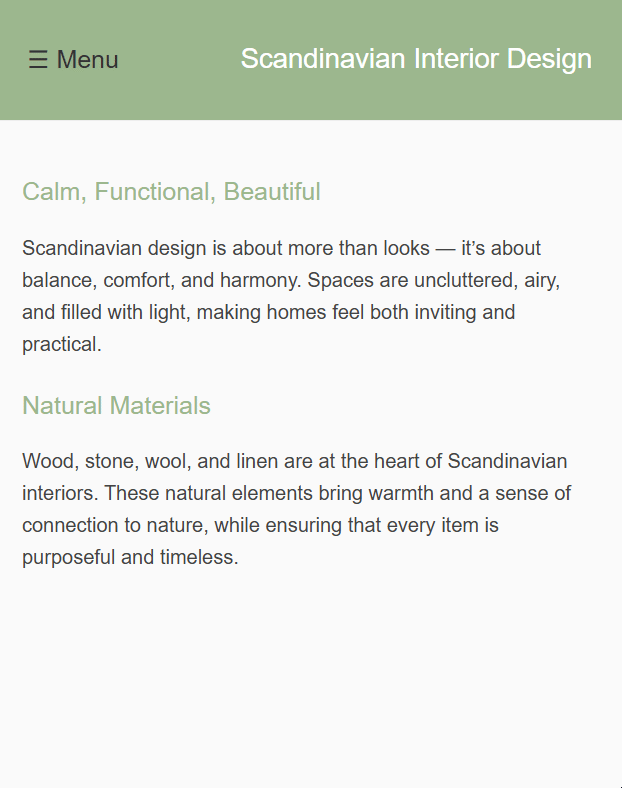
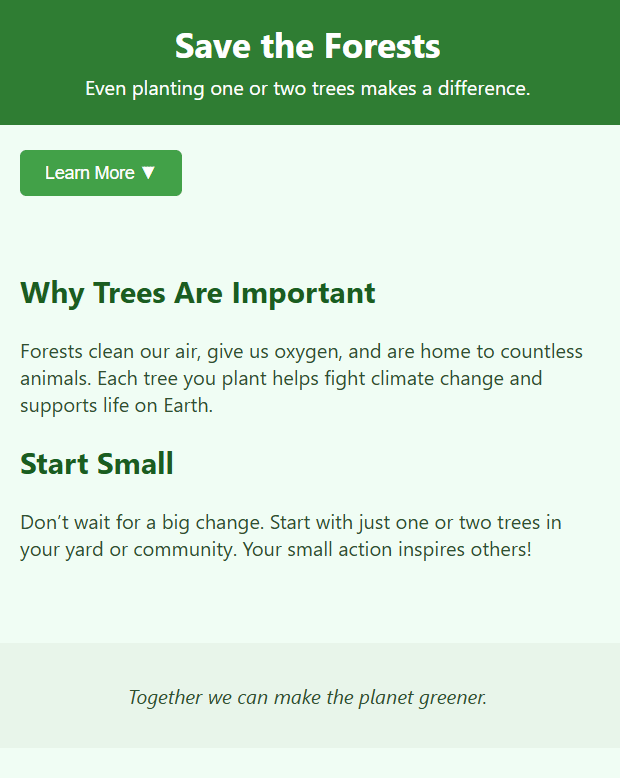
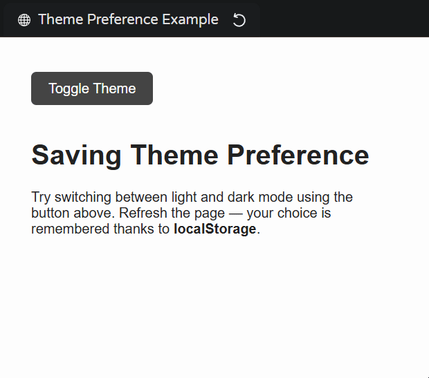
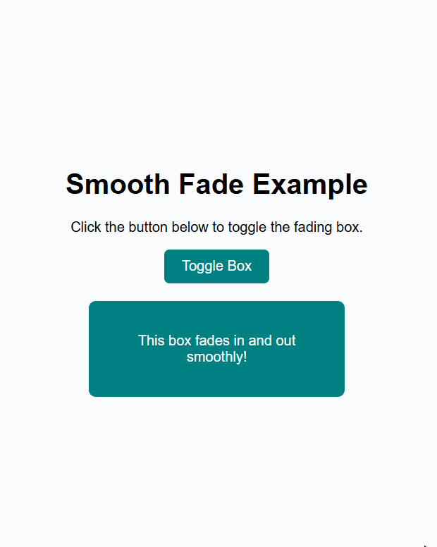
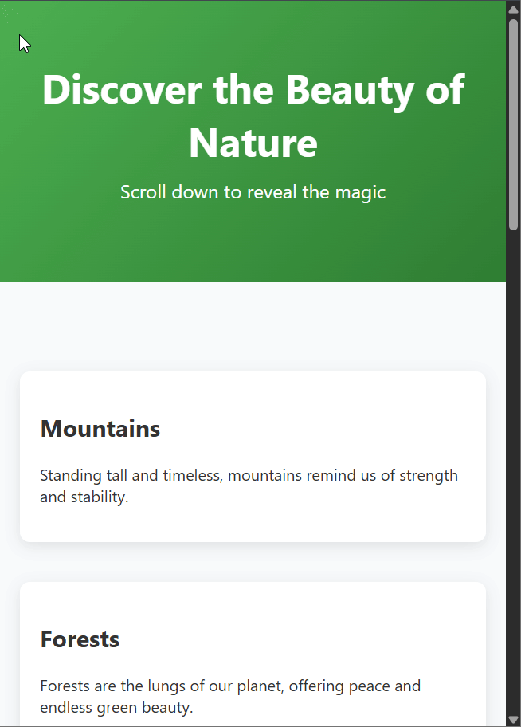

# JavaScript in Action:

## Interactivity/UI Components:

### Tabs:

Tabs let users switch between <i>different pieces on content without leaving the page</i>.

#### Key Points:

1. We use the **display property to `none` / `block`** so that we can show or hide the elements.
2. When the user clicks a tab, we **call the function** and pass the tab's ID.
3. Inside the function, we use the `querySelectorAll()` + `forEach()` loop to select all elements and hide all tab contents.
4. FInally, we **show the one that matches the ID**.

#### Basic Syntax:

```html
<div class="tabs">
  <button class="tab" onclick="openTab('services')">Services</button>
  <button class="tab" onclick="openTab('contact')">Contact</button>
</div>

<div id="services" class="tab-content">Our services are listed here.</div>
<div id="contact" class="tab-content" style="display:none;">Contact us at contact@example.com.</div>

<script>
  function openTab(tabId) {
    // Hide all tab contents
    document.querySelectorAll('.tab-content').forEach(el => el.style.display = 'none');
    // Show the selected tab
    document.getElementById(tabId).style.display = 'block';
  }
</script>
```

##### Breakdown:

To make this tab system function to work, the JavaScript follows a simple **"Clear and Show"** logic.

**1. The Trigger (Event Handling):** The attribute `onClick` which is located inside the `<button>` tags lead to the function called `openTab('id')` that is defined in the `<script>` tag (this contains JavaScript code). This will trigger when the user clicks on the button.

**2. The Reset (Hiding Everything):** Once the function runs, the line `document.querySelectorAll('.tab-content').forEach(...)` will locate every element with the class `tab-content` and sets its CSS to `display: none`.

**3. The Activation (Targeting the ID):** Within the line `document.getElementById(tabId)`, the program will use the **ID** received in step 1 to locate the specific `<div>` the user wants to view.

**4. The Display (Updating CSS):** Finally, once the `.style.display = 'block'` value is set to the overridden element, changing it from `none` (hidden) to `block` (visible), the content will instantly appear on the screen, ending the script execution.

#### Example of Usage:

##### HTML:

```html
<!DOCTYPE html>
<html lang="en">
<head>
    <meta charset="UTF-8">
    <meta name="viewport" content="width=device-width, initial-scale=1">
    <title>Simple Tabs Example</title>
    <link rel="stylesheet" href="styles.css">
    <script src="main.js" defer></script>
</head>
<body>
    <div class="tabs">
        <!-- Each button calls the function and passes the tab's ID -->
        <button class="tab" onclick="openTab('home')">Home</button>
        <button class="tab" onclick="openTab('about')">About</button>
        <button class="tab" onclick="openTab('contact')">Contact</button>
    </div>

    <!-- By default, only "Home" is visible -->
    <div id="home" class="tab-content">Welcome to the homepage!</div>
    <div id="about" class="tab-content">Learn more about us here.</div>
    <div id="contact" class="tab-content">Get in touch with us.</div>
</body>
</html>
```

##### CSS:

```css
body {
    font-family: Arial, sans-serif;
    background: #f0f8ff; /* very light blue background */
    padding: 30px;
    color: #333;
}

.tabs {
    display: flex;
    gap: 10px;
    margin-bottom: 15px;
}

.tab {
    padding: 10px 18px;
    border: none;
    background: #90caf9; /* light blue */
    color: #fff;
    border-radius: 6px 6px 0 0;
    cursor: pointer;
    font-size: 14px;
    font-weight: bold;
    transition: background 0.2s ease, transform 0.1s ease;
}

#home { display: block; }
#about { display: none; }
#contact { display: none; }

.tab:hover {
    background: #64b5f6; /* brighter blue on hover */
}

.tab:active {
    transform: translateY(1px);
}

.tab:focus {
    outline: none;
    box-shadow: 0 0 0 3px rgba(33, 150, 243, 0.4);
}

.tab-content {
    background: #ffffff;
    border: 2px solid #90caf9;
    border-radius: 0 6px 6px 6px;
    padding: 20px;
    line-height: 1.5;
    box-shadow: 0 2px 8px rgba(0,0,0,0.1);
}
```

##### JavaScript:

```js
const doc = document;

function openTab(tabId) {
    doc.querySelectorAll('.tab-content').forEach(element => {
        element.style.display = 'none';
    });
    document.getElementById(tabId).style.display = 'block';
}
```

##### Result:


### Accordion (expand/collapse):

An **accordion** is a UI component that lets you expand and collapse sections of content. It's often used for FAQs (click a question → show the answer, click again → hide it).
The idea is simple: When you click a header, JavaScript toggles the visibility of the content below.

#### Key Point:

1. We have a **button** and a **content element** that is hidden by default (`display: none`).
2. Clicking the button **triggers the function** and passes the ID of the element that should open.
3. Inside the function:
    - If the element is already showing (`display: block`), we **hide it** (`display: none`).
    - Else, **we show it** (`display: block`).

#### Basic Syntax:

```html
<button onclick="toggle('p1')">Question 1</button>
<div id="p1" style="display:none;">Answer 1</div>

<script>
  function toggle(id) {
    const element = document.getElementById(id); // Obtain the element by ID
    if (element.style.display === "block") { // If the display is set to "block", define it to "none"
      element.style.display = "none";
    } else { // Otherwise, we set it to "block"
      element.style.display = "block";
    }
  }
</script>
```

#### Example of Usage:

##### HTML:

```html
<!DOCTYPE html>
<html lang="en">
<head>
  <meta charset="UTF-8">
  <meta name="viewport" content="width=device-width, initial-scale=1">
  <title>FAQ Accordion</title>
  <link rel="stylesheet" href="style.css">
</head>
<body>

  <h1>FAQ Coffee Lovers</h1>

  <button class="accordion" onclick="togglePanel('q1')">What is the best way to brew coffee at home?</button>
  <div id="q1" class="panel">
    The French press and pour-over methods are popular for making rich, flavorful coffee at home.
  </div>

  <button class="accordion" onclick="togglePanel('q2')">Where do coffee beans come from?</button>
  <div id="q2" class="panel">
    Most coffee beans are grown in countries around the equator, such as Brazil, Ethiopia, and Colombia.
  </div>

  <button class="accordion" onclick="togglePanel('q3')">How late can I drink coffee?</button>
  <div id="q3" class="panel">
    It's best to avoid coffee 6 hours before bedtime, since caffeine can affect your sleep.
  </div>

  <button class="accordion" onclick="togglePanel('q4')">Should I add milk or drink it black?</button>
  <div id="q4" class="panel">
    It depends on your taste! Black coffee has stronger flavor, while milk softens the bitterness.
  </div>
  <script src="script.js"></script>
</body>
</html>
```

##### CSS:

```css
body {
  font-family: Arial, sans-serif;
  background: #f9f9f9;
  padding: 40px;
  color: #333;
}

h1 {
  text-align: center;
  margin-bottom: 30px;
}

.accordion {
  background: #90caf9;
  color: #fff;
  cursor: pointer;
  padding: 15px;
  width: 100%;
  border: none;
  text-align: left;
  outline: none;
  margin-bottom: 5px;
  border-radius: 6px;
  font-size: 16px;
  font-weight: bold;
  transition: background 0.2s ease;
}

.accordion:hover {
  background: #64b5f6;
}

.panel {
  padding: 15px;
  border: 1px solid #90caf9;
  border-radius: 6px;
  margin-bottom: 10px;
  background: #ffffff;
  display: none; /* hidden by default */
}
```

##### JavaScript:

```js
function togglePanel(tabId) {
  const elem = document.getElementById(tabId);
  if (elem.style.display === "block") elem.style.display = "none";
  else elem.style.display = "block";
}
```

##### Result:


### Modal (open/close):

A **modal** is a small window that appears "on top" of the page to <i>grab the user's attention</i>. It's often used ofter login forms, notifications, or confirmations.

#### Key Points:

1. The modal is **hidden by default (`display: none`).
2. Clicking the **"Open" button (x)** runs the `openModal()` function → sets `display: block`.
3. Inside the modal, the **close button (x)** runs the `closeModal()` function → sets `display: none`.
4. Often you can also make it close by clicking **outside the modal** (on the dark overlay).

#### Basic Syntax:

```html
<!-- Button to open modal -->
<button onclick="openModal()">Open Modal</button>

<!-- Modal overlay + content -->
<div id="overlay" style="display:none;">
  <div class="modal">
    <span onclick="closeModal()">×</span>
    <p>This is a modal window.</p>
  </div>
</div>

<script>
  function openModal() {
    document.getElementById("overlay").style.display = "block";
  }
  function closeModal() {
    document.getElementById("overlay").style.display = "none";
  }
</script>
```

#### Example of Usage:

##### HTML:

```html
<!DOCTYPE html>
<html lang="en">
<head>
  <meta charset="UTF-8">
  <meta name="viewport" content="width=device-width, initial-scale=1">
  <title>Space Facts – Modal Example</title>
  <link rel="stylesheet" href="style.css">
</head>
<body>

  <h1>Space Facts</h1>
  <p>Click the button below to learn something cool about space.</p>

  <!-- Buttons that open modals -->
  <button onclick="openModal('fact')">Fact 1</button>

  <!-- Overlay + Modal Content -->
  <div id="overlay" class="overlay" onclick="closeModal()">
    <div id="fact" class="modal">
      <span class="close-btn" onclick="closeModal()">×</span>
      <h2>Shooting Stars</h2>
      <p>Shooting stars are actually tiny meteors burning up as they enter Earth’s atmosphere.</p>
    </div>
  </div>

  <script src="script.js"></script>
</body>
</html>
```

#### CSS:

```css
body {
  font-family: Arial, sans-serif;
  background: #0d1b2a;
  color: #eee;
  text-align: center;
  padding: 40px;
}

h1 {
  margin-bottom: 20px;
  color: #90caf9;
}

button {
  padding: 10px 20px;
  margin: 10px;
  border: none;
  border-radius: 6px;
  background: #90caf9;
  color: #fff;
  font-weight: bold;
  cursor: pointer;
  transition: background 0.2s ease;
}

button:hover {
  background: #64b5f6;
}

.overlay {
  position: fixed;
  top: 0; left: 0;
  width: 100%; height: 100%;
  background: rgba(0, 0, 0, 0.7);
  display: none;
}

.modal {
  background: #fff;
  color: #333;
  padding: 20px;
  margin: 100px auto;
  width: 350px;
  border-radius: 8px;
  box-shadow: 0 2px 8px rgba(0,0,0,0.3);
  display: none; /* the modal hidden by default */
}

.close-btn {
  float: right;
  cursor: pointer;
  font-size: 20px;
  color: #888;
}

.close-btn:hover {
  color: #000;
}
```

##### JavaScript:

```js
function openModal(modalId) {
  // Show the overlay
  document.getElementById("overlay").style.display = "block";
  
  // Show the modal
  document.getElementById(modalId).style.display = "block";
}

function closeModal() {
  document.getElementById("overlay").style.display = "none";
}
```

##### Result:


### Dropdown:

The dropdown component is a common UI element that reveals additional content when clicked.

#### Basic Syntax:

Create the HTML structure for the dropdown:

```html
<div class="dropdown">
  <button class="dropdown-toggle">Select an option</button>
  <div class="dropdown-menu">
    <a href="#">Option 1</a>
    <a href="#">Option 2</a>
    <a href="#">Option 3</a>
  </div>
</div>
```

Next, add some basic CSS to style the dropdown.

```css
.dropdown {
  position: relative;
  display: inline-block;
}
.dropdown-menu {
  display: none;
  position: absolute;
  background-color: #f9f9f9;
  z-index: 1;
}
.show {
  display: block;
}
```

And finally, insert some JavaScript to toggle the dropdown menu:

```js
const dropdownToggle = document.querySelector('.dropdown-toggle');
const dropdownMenu = document.querySelector('.dropdown-menu');

dropdownToggle.addEventListener('click', function() {
  dropdownMenu.classList.toggle('show');
});
```

##### Breakdown:

**1. Selecting the Elements:** The `const  dropdownToggle` finds the clickable element (likely a button or a link) with the class `.dropdown-toggle`. Then the other constant variable called `dropdownMenu` finds the actual list or container with the class `.dropdown-menu`, which you would want to reveal.

**2. The Event Listener:** `addEventListener('click', ...)` will tell the browser to "listen" for a click on the toggle button, where every time a user clicks it, the code inside the `function()` would be executed!

**3. The Toggle Logic:** The function inserted inside the `addEventListener()` function is responsible for the actions of the script. If the menu does not have the class `show`, it adds it, otherwise, it removes it.

So when the button is clicked, the JavaScript **adds or removes the 'show' class**, which controls the visibility of the dropdown menu.

> [!NOTE]
> The `querySelector('.dropdown-menu')` function will only store the first element reference with the name of '.dropdown-menu', and not store any other elements with the same class. And the `classList` allows us to easily manipulate with the **CSS classes** of an element without overwriting the entire `class` attribute. So the `toggle('show')` function acts like a "switch", checking if the class contains the value 'show', it will add it and the selector at the bottom of the CSS document will be applied, otherwise, it will remove the 'show' value, unapplying the property in the 'show' selector.

#### Example of Usage:

##### HTML:

```html
<!DOCTYPE html>
<html lang="en">
<head>
  <meta charset="UTF-8">
  <meta name="viewport" content="width=device-width, initial-scale=1">
  <title>Dropdown Challenge</title>
  <link rel="stylesheet" href="style.css">
  <script src="script.js" defer></script>
</head>
<body>

  <h2>Welcome to the Dashboard</h2>
  <p>Click the button below to open your profile menu:</p>

  <div id="profileDropdown" class="dropdown">
    <button class="dropdown-toggle">
      My Profile
    </button>
    <div class="dropdown-menu">
      <a href="#">View Profile</a>
      <a href="#">Settings</a>
      <a href="#">Logout</a>
    </div>
  </div>

</body>
</html>
```

##### CSS:

```css
body {
      font-family: Arial, sans-serif;
      background: #f4f6f9;
      margin: 40px;
    }

.dropdown {
      position: relative;
      display: inline-block;
    }

.dropdown-toggle {
      background-color: #4CAF50;
      color: white;
      padding: 12px 20px;
      font-size: 16px;
      border: none;
      border-radius: 8px;
      cursor: pointer;
      transition: background 0.3s ease;
    }

.dropdown-toggle:hover {
      background-color: #45a049;
    }

.dropdown-menu {
      display: none;
      position: absolute;
      top: 110%;
      right: -50%;
      background-color: #fff;
      border-radius: 8px;
      overflow: hidden;
      min-width: 180px;
      box-shadow: 0px 8px 16px rgba(0,0,0,0.2);
      z-index: 1;
    }

.dropdown-menu a {
      color: #333;
      padding: 12px 16px;
      text-decoration: none;
      display: block;
      transition: background 0.3s ease;
    }

.dropdown-menu a:hover {
      background-color: #f1f1f1;
    }

.dropdown-menu a.logout {
      color: #d9534f;
      font-weight: bold;
    }

.show {
      display: block;
    }
```

##### JavaScript:

```js
const dropdownToggle = document.querySelector('.dropdown-toggle');
const dropdownMenu = document.querySelector('.dropdown-menu');

dropdownToggle.addEventListener('click', function() {
  dropdownMenu.classList.toggle('show');
});
```

##### Result:


## Forms & Validation:

### Input Validation:

When building forms, it's important to give users **immediate feedback** as they type, so they don't submit incorrect information. This is called **real-time validation**.

#### Basic Syntax:

Before we build this logic, we must create a basic text input field so that we can use it for validating and give feedback to the user in real-time!

```html
<input type="text" id="username" placeholder="Enter username">
```

Now, add an event listener to validate the input as the user types:

```js
const usernameInput = document.getElementById('username');
const usernameError = document.getElementById('usernameError');

usernameInput.addEventListener('input', function() {
    // Get the current value
    const value = this.value;
    
    // Check if it meets our criteria
    if (value.length < 5) {
        usernameInput.style.borderColor = "red";
      } else {
        usernameInput.style.borderColor = "green";
      }
});
```

If the validation does not meet the requirement, the input border turns **red**, only if the username is less the 5 characters long, otherwise, it'll turn **green** if it met the criteria (5 characters or more).

#### Example of Usage:

##### HTML:

```html
<!DOCTYPE html>
<html>
<head>
    <title>Email Validation</title>
    <link rel="stylesheet" href="style.css">
</head>
<body>
    <div class="container">
        <form>
            <label for="email">Email:</label>
            <input type="text" id="email" placeholder="Enter your email">
        </form>
    </div>

    <script src="script.js"></script>
</body>
</html>
```

##### CSS:

```css
body {
    font-family: Arial, sans-serif;
    padding: 40px;
    background-color: #f5f5f5;
}

h2 {
    color: #333;
    margin-bottom: 20px;
}

label {
    display: block;
    margin-bottom: 10px;
    font-weight: bold;
    color: #333;
}

input[type="text"] {
    padding: 10px 12px;
    width: 300px;
    font-size: 16px;
    border: 2px solid #ccc;
    border-radius: 5px;
}

input[type="text"]:focus {
    outline: none;
    box-shadow: 0 0 5px rgba(0,0,0,0.1);
}

.container {
    background-color: #fff;
    padding: 30px;
    border-radius: 10px;
    display: inline-block;
}
```

##### JavaScript:

```js
const emailInput = document.getElementById("email");

emailInput.addEventListener("input", function () {
    if (emailInput.value.includes("@")) {
        // Add your code below
        emailInput.style.border = "2px solid rgb(0, 250, 0)";
    } else {
        emailInput.style.border = "2px solid rgb(250, 0, 0)";
    }
});
```

##### Result:


### Custom Error Message:

Custom error messages help users understand what's wrong with their form input. Let's learn how to create and display them for form validation.

#### Basic Syntax:

First, create a basic input field and a span next to it, where we will display the message:

```html
<input type="text" id="username" placeholder="Enter username">
<span id="usernameError" class="error"></span>
```

Now, let's add JavaScript to validate the input and show a custom error message:

```js
const usernameInput = document.getElementById('username');
const usernameError = document.getElementById('usernameError');

usernameInput.addEventListener('input', function() {
    if (this.value.length < 5) {
        usernameError.textContent = "Username must be at least 5 characters long";
        usernameError.style.color = "red";
    } else {
        usernameError.textContent = "";
    }
});
```

So when a user types in the input field, the event listener checks if the username is at least 5 characters long, if not, it'll display a red error message.

#### Example of Usage:

##### HTML:

```html
<!DOCTYPE html>
<html lang="en">
<head>
  <meta charset="UTF-8">
  <meta name="viewport" content="width=device-width, initial-scale=1">
  <title>Custom error messages</title>
  <link rel="stylesheet" href="style.css">
</head>
<body>
  <div class="form-container">
    <h2>Create Your Account</h2>
    <p class="subtitle">Join our newsletter for the latest updates</p>

    <form>
      <label for="email">Email Address</label>
      <input type="text" id="email" placeholder="e.g. user@example.com">
      <span id="emailError" class="message"></span>

      <button type="button">Subscribe</button>
    </form>
  </div>

  <script src="script.js"></script>
</body>
</html>
```

##### CSS:

```css
/* General styles */
body {
  font-family: "Segoe UI", Tahoma, Geneva, Verdana, sans-serif;
  background: linear-gradient(135deg, #1e90ff, #00b894);
  display: flex;
  justify-content: center;
  align-items: center;
  height: 100vh;
  margin: 0;
}

/* Card-like form */
.form-container {
  background: #fff;
  padding: 25px 30px;
  border-radius: 10px;
  box-shadow: 0 6px 18px rgba(0,0,0,0.2);
  width: 320px;
  text-align: center;
}

h2 {
  margin-bottom: 10px;
  color: #2d3436;
}

.subtitle {
  margin-bottom: 20px;
  font-size: 14px;
  color: #636e72;
}

label {
  display: block;
  text-align: left;
  margin-bottom: 5px;
  font-weight: bold;
  color: #2d3436;
}

input {
  width: 100%;
  padding: 10px;
  font-size: 14px;
  border: 1px solid #ccc;
  border-radius: 6px;
  margin-bottom: 8px;
  transition: border-color 0.3s, box-shadow 0.3s;
}

input:focus {
  border-color: #1e90ff;
  box-shadow: 0 0 6px rgba(30, 144, 255, 0.5);
  outline: none;
}

/* Validation messages */
.message {
  font-size: 13px;
  display: block;
  margin-bottom: 10px;
  text-align: left;
}

.error {
  color: #e63946;
}

.success {
  color: #2a9d8f;
}

/* Button */
button {
  width: 100%;
  padding: 10px;
  font-size: 15px;
  background: #1e90ff;
  color: white;
  border: none;
  border-radius: 6px;
  cursor: pointer;
  transition: background 0.3s;
}

button:hover {
  background: #187bcd;
}
```

##### JavaScript:

```js
function validateEmail(inputId, errorId) {
  const inputElement = document.getElementById(inputId);
  const errorElement = document.getElementById(errorId);

  inputElement.addEventListener('input', function() {
    const emailValue = this.value;
    let hasAtSign = false;

    for (const char of emailValue) {
      if (char === "@") {
        hasAtSign = true;
        break;
      };
    };

    if (!hasAtSign) {
      errorElement.textContent = "Please enter a valid email address"
      errorElement.style.color = "red";

    } else {
      errorElement.textContent = "Looks good!";
      errorElement.style.color = "green";
      
    };

  });
};

// Initialize validation
validateEmail('email', 'emailError');
```

##### Result:


### Submit Buttons:

Submit buttons are essential elements in HTML forms that allow users to send form data to a server for processing.

#### Basic Syntax:

Create a basic HTML form with a submit button:

```html
<form id="myForm">
  <input type="text" placeholder="Enter your name">
  <button type="submit">Submit</button>
</form>
```

The `type="submit"` attribute specifies that the button should submit the form when clicked!

You can also use JavaScript to handle form submissions:

```js
const form = document.getElementById('myForm');

form.addEventListener('submit', function(event) {
  event.preventDefault(); // Prevents the default form submission
  console.log('Form submitted!'); // This prints a message in the console
});
```

The `preventDefault()` method stops the form from submitting in the traditional way, allowing you to handle the submission with JavaScript.

#### Example of Usage:

##### HTML:

```html
<!DOCTYPE html>
<html>
<head>
  <title>Submit buttons</title>
  <link rel="stylesheet" href="style.css">
</head>
<body>
  <form id="myForm">
    <h2>Sign Up</h2>
    <input type="text" id="email" placeholder="Enter your email">
    <p id="emailMessage" class="message"></p>
    <button type="submit">Submit</button>
  </form>
  <script src="script.js"></script>
</body>
</html>
```

##### CSS:

```css
body {
      font-family: Arial, sans-serif;
      background: #f7f9fc;
      display: flex;
      justify-content: center;
      align-items: center;
      height: 100vh;
      margin: 0;
    }

#myForm {
      background: #fff;
      padding: 20px 30px;
      border-radius: 8px;
      box-shadow: 0 4px 12px rgba(0,0,0,0.1);
      width: 300px;
    }

h2 {
      margin-bottom: 15px;
      text-align: center;
      color: #333;
    }

input {
      width: 100%;
      padding: 10px;
      margin-bottom: 8px;
      border: 1px solid #ccc;
      border-radius: 5px;
      font-size: 14px;
      transition: border-color 0.3s, box-shadow 0.3s;
    }

input:focus {
      outline: none;
      border-color: #1e90ff;
      box-shadow: 0 0 4px rgba(30, 144, 255, 0.4);
    }

.message {
      color: green;
      font-size: 18px;
      margin: 0;
    }

button {
      margin-top: 10px;
      width: 100%;
      padding: 10px;
      background: #1e90ff;
      color: white;
      border: none;
      border-radius: 5px;
      cursor: pointer;
      font-size: 14px;
    }

button:hover {
      background: #187bcd;
    }
```

##### JavaScript:

```js
const form = document.getElementById('myForm');
const message = document.getElementById('emailMessage');
form.addEventListener('submit', function(event) {
  event.preventDefault(); // Prevents the default form submission
  message.textContent = "Submitted successfully";
});
```

##### Result:


## Notifications & Feedback:

### Toast Message:

The **toast message** is a small notification that briefly appears on the screen to give feedback to the user. It usually fades out after a few seconds.

#### Basic Syntax:

HTML structure:

```html
<div class="container">
    <button id="showToast">Show Toast</button>
    <div id="toast" class="hidden">This is a toast message!</div>
</div>
```

Then add some CSS to style the toast, where we will be using two classes: `.hidden` to keep it invisible, and `.show` to make it appear.

```css
.toast {
    position: fixed;
    bottom: 20px;
    left: 50%;
    background-color: #333;
    color: white;
    padding: 15px 25px;
}
.show {
    opacity: 1;
}
.hidden {
    display: none;
}
```

Now, add JavaScript to show and hide the toast:

```js
const showToastBtn = document.getElementById('showToast');
const toast = document.getElementById('toast');

showToastBtn.addEventListener('click', function() {
    toast.classList.remove('hidden');
    toast.classList.add('show');

    setTimeout(function() {
        toast.classList.remove('show');
        toast.classList.add('hidden');
    }, 3000);
});
```

This script will make the toast visible when the button is clicked, and automatically hides it after 3 seconds!

#### Example of Usage:

##### HTML:

```html
<!DOCTYPE html>
<html>
<head>
  <title>Toast Notification Example</title>
  <link rel="stylesheet" href="style.css">
</head>
<body>
  <header>
    <h1>My Profile Settings</h1>
  </header>

  <main>
    <p>Update your profile and save changes. A toast message will confirm your action.</p>
    <button id="showToast">Save Changes</button>
  </main>

  <!-- Toast -->
  <div id="toast" class="toast hidden">✅Your changes have been saved!</div>

  <script src="script.js"></script>
</body>
</html>
```

##### CSS:

```css
/* Page styling */
body {
  font-family: Arial, sans-serif;
  background: #dee5ee;
  margin: 0;
  padding: 0;
  display: flex;
  flex-direction: column;
  min-height: 100vh;
}

header {
  background: #012494;
  color: white;
  padding: 15px;
  text-align: center;
}

main {
  flex: 1;
  display: flex;
  flex-direction: column;
  padding: 20px;
  align-items: center;
  gap: 15px;
}

button {
  padding: 12px 20px;
  background-color: #1e90ff;
  color: white;
  border: none;
  border-radius: 6px;
  font-size: 16px;
  cursor: pointer;
  transition: background 0.3s;
}

button:hover {
  background-color: #187bcd;
}

/* Toast styling */
.toast {
  position: fixed;
  bottom: 10rem;
  left: 50%;
  padding: 10px;
  transform: translate(-50%, -50%);
  background-color: rgb(0, 185, 25);
  color: rgb(56, 56, 56);
  border-radius: 10px;
  opacity: 0;
}

.show {
  opacity: 1;
}

.hidden {
  display: none;
}
```

##### JavaScript:

```js
const showToastBtn = document.getElementById('showToast');
const toast = document.getElementById('toast');

showToastBtn.addEventListener('click', function() {
  // Show the toast
  toast.classList.remove('hidden');
  toast.classList.add('show');
  
  // Hide after 3 seconds
  setTimeout(function() {
    toast.classList.remove('show');
    toast.classList.add('hidden');
  }, 3000);
});
```

##### Result:



### Dismissible Banners:

A **dismissible banner** is a notification or message bar that appears at the top (or bottom) of the page and can be closed by the user. These are often used to sho important information, like cookie policies, announcements, or warnings. The key feature is the **close (x) button** that lets the user hide the banner without refreshing the page!

#### Basic Syntax:

Add the HTML structure:

```html
<div class="banner" id="banner">
  <p>This is an important announcement!</p>
  <button id="closeBanner">X</button>
</div>
```

Add some basic CSS styles to our banner:

```css
.banner {
  background-color: #1e90ff;
  color: white;
  padding: 15px 20px;
  text-align: center;
  position: relative;

}

.banner button {
  position: absolute;
  right: 10px;
  top: 10px;
  border: none;

  cursor: pointer;
}
```

And finally, add JavaScript to make the banner dismissible:

```js
const banner = document.getElementById('banner');
const closeBtn = document.getElementById('closeBanner');

closeBtn.addEventListener('click', function() {
  banner.style.display = 'none';
});
```

##### Visual Demonstration:



When the close button (x) is clicked, the banner will disappear! (because it will be hidden).

#### Example of Usage:

##### HTML:

```html
<!DOCTYPE html>
<html>
<head>
  <title>Dismissible Banner Example</title>
  <link rel="stylesheet" href="style.css">
</head>
<body>

  <!-- Banner -->
  <div class="banner" id="banner">
    <p>Big News! Our new course is live. Enroll today and get 30% off!</p>
    <button id="closeBanner">&times;</button>
  </div>

  <!-- Page Content -->
  <header class="hero">
    <h1>Welcome to CodeLearn</h1>
    <p>Practical lessons to sharpen your web development skills 🚀</p>
  </header>

  <main class="content">
    <section>
      <h2>Learn by Doing</h2>
      <p>Each lesson comes with tasks and challenges so you can practice immediately.</p>
    </section>

    <section>
      <h2>Topics We Cover</h2>
      <ul>
        <li>HTML & CSS basics</li>
        <li>JavaScript essentials</li>
        <li>Frontend projects</li>
        <li>Interactive UI components</li>
      </ul>
    </section>
  </main>

  <footer>
    <p>&copy; 2025 CodeLearn. All rights reserved.</p>
  </footer>

  <script src="script.js"></script>
</body>
</html>
```

##### CSS:

```css
/* Reset */
* {
  margin: 0;
  padding: 0;
  box-sizing: border-box;
}

/* Banner */
.banner {
  background-color: #b5cbe0;
  color: white;
  padding: 15px 20px;
  text-align: center;
  position: relative;
  font-size: 16px;
  font-weight: 500;
}

.banner button {
  position: absolute;
  right: 15px;
  top: 10px;
  background: none;
  border: none;
  color: white;
  font-size: 22px;
  cursor: pointer;
}

/* Hero Section */
.hero {
  background: linear-gradient(135deg, #4389ce, #0a033b);
  color: white;
  text-align: center;
  padding: 80px 20px;
}

.hero h1 {
  font-size: 2.5rem;
  margin-bottom: 10px;
}

.hero p {
  font-size: 1.2rem;
}

/* Main Content */
.content {
  max-width: 800px;
  margin: 40px auto;
  padding: 0 20px;
}

.content h2 {
  margin-bottom: 10px;
  color: #333;
}

.content p, 
.content ul {
  color: #555;
  margin-bottom: 20px;
  line-height: 1.6;
}

.content ul {
  list-style: disc;
  padding-left: 20px;
}

/* Footer */
footer {
  background-color: #faf2f2;
  text-align: center;
  padding: 20px;
  color: #777;
  margin-top: 40px;
}
```

##### JavaScript:

```js
const banner = document.getElementById('banner');
const closeBtn = document.getElementById('closeBanner');

closeBtn.addEventListener('click', function() {
  banner.style.display = 'none';
});
```

##### Result:


### Loading Indicators:

Loading indicators are small visual elements (like spinners or animations) that <i>let users know something is happening in the background (when submitting a form or loading data)</i>. They improve user experience by showing feedback instead of leaving the user guessing!

#### Basic Syntax:

Add HTML to your page as usual:

```html
<div id="loading-spinner" class="spinner-hidden">
  <div class="spinner"></div>
</div>
```

Apply CSS style to the element so it looks like a wheel, and use `@keyframes` to keep spinning it endlessly, while having the option to alter the spin with precision. We also use a `.hidden` class to keep the spinner invisible when needed.

```css
.spinner {
  width: 40px;
  height: 40px;
  border: 4px solid #f3f3f3;
  border-top: 4px solid #3498db;
  border-radius: 50%;
  animation: spin 1s linear infinite;
}

.hidden {
  display: none;
}

@keyframes spin {
  0% { transform: rotate(0deg); }
  100% { transform: rotate(360deg); }
}
```

And we add JavaScript to show/hide the spinner:

```js
const loadBtn = document.getElementById("loadBtn");
const spinner = document.getElementById("spinner");

loadBtn.addEventListener("click", function () {
  // Show spinner
  spinner.classList.remove("hidden");

  // After 3 seconds, hide spinner and show alert
  setTimeout(function () {
    spinner.classList.add("hidden");
    alert("Data loaded successfully!");
  }, 3000);
});
```

##### Visual Demonstration:

This is how it'll look like:


When the button is clicked, we show the spinner, wait 3 seconds, then hide it and display an alert. But for this demonstration, we only showed the button... View down bellow the example.

#### Example of Usage:

##### HTML:

```html
<!DOCTYPE html>
<html>
<head>
  <title>Loading Spinner Example</title>
  <link rel="stylesheet" href="style.css">
</head>
<body>
  <div class="container">
    <h1>Welcome to My Page</h1>
    <p>Click the button below to simulate loading data.</p>
    <button id="loadBtn">Load Data</button>
    <div id="spinner" class="spinner hidden"></div>
  </div>

  <script src="script.js"></script>
</body>
</html>
```

##### CSS:

```css
body {
  font-family: Arial, sans-serif;
  background: #f5f7fa;
  display: flex;
  justify-content: center;
  align-items: center;
  height: 100vh;
  margin: 0;
}

.container {
  background: white;
  padding: 30px;
  border-radius: 12px;
  box-shadow: 0 4px 12px rgba(0,0,0,0.1);
  text-align: center;
  width: 320px;
}

h1 {
  margin-bottom: 10px;
  color: #333;
}

p {
  margin-bottom: 20px;
  color: #555;
}

button {
  padding: 10px 20px;
  font-size: 16px;
  background: #1e90ff;
  border: none;
  border-radius: 8px;
  color: white;
  cursor: pointer;
  transition: background 0.3s;
}

button:hover {
  background: #187bcd;
}

/* Spinner styling */
.spinner {
  margin: 20px auto 0;
  border: 6px solid #f3f3f3;
  border-top: 6px solid #1e90ff;
  border-radius: 50%;
  width: 40px;
  height: 40px;
  animation: spin 1s linear infinite;
}

.hidden {
  display: none;
}

@keyframes spin {
  0% { transform: rotate(0deg); }
  100% { transform: rotate(360deg); }
}
```

##### JavaScript:

```js
const loadBtn = document.getElementById("loadBtn");
const spinner = document.getElementById("spinner");

loadBtn.addEventListener("click", function () {
  // Show spinner
  spinner.classList.remove("hidden");
  // After 3 seconds, hide spinner
  setTimeout(function () {
    spinner.classList.add("hidden");
  }, 3000);
});
```

##### Result:



## Navigation:

### Mobile Burger Menu Toggle (☰):

On small screens, websites often use a **burger (☰) icon** instead of showing the full navigation. WWhen the user clicks the burger icon, JavaScript toggles the visibility of the navigation menu.

#### Basic Syntax:

First, create the HTML structure for the burger menu icon. This will include a button with 3 spans (styles as lines in CSS to firm the burger icon) and a hidden `<nav>` section that contains the menu links.

```html
<button id="burger-btn" class="burger-menu">
  <span class="bar"></span>
  <span class="bar"></span>
  <span class="bar"></span>
</button>

<nav id="mobile-nav" class="hidden">
  <ul>
    <li><a href="#">Home</a></li>
    <li><a href="#">About</a></li>
    <li><a href="#">Services</a></li>
    <li><a href="#">Contact</a></li>
  </ul>
</nav>
```

No, let's add some basic CSS to style the burger menu:

```css
.burger-menu {
  display: block;
  cursor: pointer;
  background: none;
  border: none;
  padding: 10px;
}

.bar {
  display: block;
  width: 25px;
  height: 3px;
  margin: 5px 0;
  background-color: #333;
}

.hidden {
  display: none;
}

/* Show the navigation when it doesn't have the hidden class */
nav:not(.hidden) {
  display: block;
}
```

Lastly, insert JavaScript to toggle the menu:

```js
// Select the burger button and mobile navigation
const burgerBtn = document.getElementById('burger-btn');
const mobileNav = document.getElementById('mobile-nav');

// Add click event listener to the burger button
burgerBtn.addEventListener('click', function() {
  // Toggle the hidden class on the mobile navigation
  mobileNav.classList.toggle('hidden');
});
```

##### Visual Demonstration:



When you click the burger button, the hidden class is toggled on the navigation menu, making it appear or disappear.

#### Example of Usage:

##### HTML:

```html
<!DOCTYPE html>
<html lang="en">
<head>
  <title>Minimalism Lifestyle</title>
  <link rel="stylesheet" href="style.css">
</head>
<body>
  <!-- Burger Button -->
  <div id="myButton" class="burger-btn">
    <div class="line"></div>
    <div class="line"></div>
    <div class="line"></div>
  </div>

  <!-- Navigation Menu -->
  <nav id="myMenu" class="menu">
    <ul>
      <li><a href="#">Home</a></li>
      <li><a href="#">Philosophy</a></li>
      <li><a href="#">Gallery</a></li>
      <li><a href="#">Contact</a></li>
    </ul>
  </nav>

  <!-- Main Content -->
  <header class="hero">
    <h1>Minimalism</h1>
    <p>Less but better. Enjoy the essentials, remove the noise.</p>
    
  </header>

  <section class="content">
    <h2>The Essence of Minimalism</h2>
    <p>
      Minimalism is not about having less, but about making room for what truly matters. 
      It is about quality over quantity, clarity over clutter, and creating spaces that breathe. 
      Whether in design or lifestyle, minimalism helps us live with purpose and appreciation.
    </p>
  </section>

  <script src="script.js"></script>
</body>
</html>
```

##### CSS:

```css
/* Reset */
body {
  margin: 0;
  font-family: "Helvetica Neue", Arial, sans-serif;
  background: #f8f8f8;
  color: #333;
}

/* Burger Button */
.burger-btn {
  cursor: pointer;
  padding: 15px;
  position: fixed;
  top: 20px;
  left: 20px;
  z-index: 1000;
}
.burger-btn .line {
  width: 30px;
  height: 3px;
  background-color: #333;
  margin: 6px 0;
  transition: all 0.3s ease;
}

/* Burger animation */
.burger-btn.active .line:nth-child(1) {
  transform: rotate(45deg) translate(5px, 5px);
}
.burger-btn.active .line:nth-child(2) {
  opacity: 0;
}
.burger-btn.active .line:nth-child(3) {
  transform: rotate(-45deg) translate(6px, -6px);
}

/* Navigation menu */
.menu {
  display: none;
  position: fixed;
  top: 0;
  right: 0;
  width: 220px;
  height: 100vh;
  background: #ffffff;
  box-shadow: -2px 0 10px rgba(0, 0, 0, 0.1);
  padding-top: 70px;
}
.menu ul {
  list-style: none;
  padding: 0;
}
.menu li {
  margin: 20px 0;
  text-align: center;
}
.menu a {
  text-decoration: none;
  color: #333;
  font-size: 18px;
}
.menu a:hover {
  color: #888;
}
.menu.active {
  display: block;
}

/* Hero section */
.hero {
  text-align: center;
  padding: 80px 20px 40px;
}
.hero h1 {
  font-size: 2.5rem;
  margin-bottom: 10px;
  letter-spacing: 2px;
}
.hero p {
  font-size: 1.2rem;
  margin-bottom: 30px;
  color: #666;
}
.hero img {
  max-width: 90%;
  border-radius: 10px;
  box-shadow: 0 4px 12px rgba(0,0,0,0.1);
}

/* Content section */
.content {
  max-width: 700px;
  margin: 40px auto;
  padding: 0 20px;
  line-height: 1.6;
}
.content h2 {
  font-size: 1.8rem;
  margin-bottom: 15px;
}
.content p {
  font-size: 1rem;
  color: #555;
}
```

##### JavaScript:

```js
function toggleMenu(buttonId, menuId) {
  const button = document.getElementById(buttonId);
  const menu = document.getElementById(menuId);

  button.addEventListener("click", function () {
    button.classList.toggle("active");
    menu.classList.toggle("active");
  });
}

// Call function
toggleMenu("myButton", "myMenu");
```

##### Result:



### Collapsible Side Navigation:

A collapsible side navigation is a hidden menu on the side of the screen that slides in when a button is clicked. It helps save space while still giving users quick access to navigation links.

#### Basic Syntax:

Construct the HTML structure with a side navigation and toggle button:

```html
<button id="toggleNav">☰ Menu</button>

<nav id="sideNav" class="sidenav">
  <a href="#">Home</a>
  <a href="#">About</a>
  <a href="#">Services</a>
  <a href="#">Contact</a>
</nav>
```

Style the side navigation with CSS:

```css
.sidenav {
  height: 100%;
  width: 0;
  position: fixed;
  top: 0;
  left: 0;
  background-color: #111;
  overflow-x: hidden;
  transition: 0.3s;
  padding-top: 60px;
}

.sidenav.open {
  width: 250px;
}
```

Apply JavaScript to toggle the navigation:

```js
const toggleBtn = document.getElementById('toggleNav');
const sideNav = document.getElementById('sideNav');

toggleBtn.addEventListener('click', function() {
  sideNav.classList.toggle('open');
});
```

hen the button is clicked, the side navigation ill slide in or out depending on its current state.

#### Example of Usage:

##### HTML:

```html
<!DOCTYPE html>
<html>
<head>
  <title>Scandinavian Interior Design</title>
  <link rel="stylesheet" href="style.css">
</head>
<body>
  <div id="sideNav" class="sidenav">
    <a href="javascript:void(0)" class="close-btn" onclick="closeNav()">X</a>
    <a href="#">Home</a>
    <a href="#">Philosophy</a>
    <a href="#">Materials</a>
    <a href="#">Inspiration</a>
    <a href="#">Contact</a>
  </div>

  <header>
    <span class="open-btn" onclick="openNav()">☰ Menu</span>
    <h1>Scandinavian Interior Design</h1>
  </header>

  <main>
    <section>
      <h2>Calm, Functional, Beautiful</h2>
      <p>
        Scandinavian design is about more than looks — it’s about balance,
        comfort, and harmony. Spaces are uncluttered, airy, and filled with
        light, making homes feel both inviting and practical.
      </p>
    </section>

    <section>
      <h2>Natural Materials</h2>
      <p>
        Wood, stone, wool, and linen are at the heart of Scandinavian interiors.
        These natural elements bring warmth and a sense of connection to nature,
        while ensuring that every item is purposeful and timeless.
      </p>
    </section>
  </main>

  <script src="script.js"></script>
</body>
</html>
```

##### CSS:

```css
body {
  margin: 0;
  font-family: "Helvetica Neue", Arial, sans-serif;
  background-color: #fafafa;
  color: #333;
  line-height: 1.6;
}

/* Side navigation */
.sidenav {
  height: 100%;
  width: 0;
  position: fixed;
  top: 0;
  left: 0;
  background-color:#f5f2eb;
  box-shadow: 2px 0 8px rgba(0, 0, 0, 0.05);
  overflow-x: hidden;
  transition: 0.3s;
  padding-top: 60px;
}

.sidenav a {
  display: block;
  padding: 12px 24px;
  text-decoration: none;
  font-size: 18px;
  color: #444;
  transition: background 0.2s, color 0.2s;
}

.sidenav a:hover {
  background-color:#d9b382;
  color: #000;
}

.close-btn {
  position: absolute;
  top: 15px;
  right: 20px;
  font-size: 24px;
  text-decoration: none;
  color: #999;
}

.close-btn:hover {
  color: #d9b382;
}

/* Header */
header {
  display: flex;
  justify-content: space-between;
  align-items: center;
  padding: 16px 24px;
  border-bottom: 1px solid #eee;
  background-color:#9bb78d;
}

.open-btn {
  font-size: 20px;
  cursor: pointer;
  color: #333;
}

h1 {
  font-size: 22px;
  font-weight: 500;
  color: white;
}

/* Main content */
main {
  max-width: 800px;
  margin: 40px auto;
  padding: 0 20px;
}

h2 {
  font-size: 20px;
  margin-top: 20px;
  font-weight: 500;
  color: #9bb78d;
}

p {
  margin: 12px 0;
  color: #444;
}
```

##### JavaScript:

```js
function closeNav() {
  document.getElementById("sideNav").style.width = "0";
}

function openNav() {
  const sideNav = document.getElementById("sideNav");

  sideNav.style.width = "250px";
}
```

##### Result:



### Dropdown Menus:

**Dropdown menus** are UI components that reveal additional options when triggered. They're commonly used in navigation to organize content without taking up too much space.

#### Basic Syntax:

Create the HTML structure for the dropdown:

```html
<div class="dropdown">
  <button class="dropdown-toggle">Menu</button>
  <div class="dropdown-menu">
    <a href="#">Option 1</a>
    <a href="#">Option 2</a>
    <a href="#">Option 3</a>
  </div>
</div>
```

Apply CSS to hide/show the dropdown menu:

```css
.dropdown-menu {
  display: none;
}

.dropdown-menu.show {
  display: block;
}
```

And add JavaScript to toggle to dropdown visibility:

```js
// Get the dropdown toggle button
const dropdownToggle = document.querySelector('.dropdown-toggle');

// Get the dropdown menu
const dropdownMenu = document.querySelector('.dropdown-menu');

// Add click event listener to the toggle button
dropdownToggle.addEventListener('click', function() {
  // Toggle the 'show' class on the dropdown menu
  dropdownMenu.classList.toggle('show');
});
```

When you click the "Menu" button, the dropdown menu will appear, clicking it again will hide the menu.

#### Example of Usage:

##### HTML:

```html
<!DOCTYPE html>
<html>
<head>
  <title>Save the Forests</title>
  <link rel="stylesheet" href="style.css">
</head>
<body>
  <header>
    <h1>Save the Forests</h1>
    <p>Even planting one or two trees makes a difference.</p>
  </header>

  <div class="dropdown">
    <button class="dropbtn" onclick="toggleDropdown()">Learn More ▼</button>
    <div id="myDropdown" class="dropdown-content">
      <a href="#">Why forests matter</a>
      <a href="#">How to grow a tree</a>
      <a href="#">Community projects</a>
    </div>
  </div>

  <main>
    <section>
      <h2>Why Trees Are Important</h2>
      <p>
        Forests clean our air, give us oxygen, and are home to countless animals.  
        Each tree you plant helps fight climate change and supports life on Earth.
      </p>
    </section>
    <section>
      <h2> Start Small</h2>
      <p>
        Don’t wait for a big change. Start with just one or two trees in your yard or community.  
        Your small action inspires others!
      </p>
    </section>
  </main>

  <footer>
    <p> Together we can make the planet greener.</p>
  </footer>

  <script src="script.js"></script>
</body>
</html>
```

##### CSS:

```css
body {
  font-family: "Segoe UI", sans-serif;
  margin: 0;
  padding: 0;
  background: #f0fdf4; /* light green background */
  color: #2f4f2f;
}

header {
  background: #2e7d32;
  color: white;
  padding: 20px;
  text-align: center;
}

header h1 {
  margin: 0;
  font-size: 28px;
}

header p {
  margin: 5px 0 0;
  font-size: 16px;
}

main {
  padding: 20px;
  max-width: 800px;
  margin: auto;
}

h2 {
  color: #1b5e20;
}

footer {
  text-align: center;
  padding: 15px;
  background: #e8f5e9;
  margin-top: 30px;
  font-style: italic;
}

/* Dropdown styles */
.dropdown {
  position: relative;
  display: inline-block;
  margin: 20px;
}

.dropbtn {
  background-color: #43a047;
  color: white;
  padding: 10px 20px;
  font-size: 14px;
  border: none;
  border-radius: 5px;
  cursor: pointer;
}

.dropbtn:hover {
  background-color: #388e3c;
}

.dropdown-content {
  display: none;
  position: absolute;
  background-color: #ffffff;
  min-width: 200px;
  box-shadow: 0px 8px 16px rgba(0,0,0,0.2);
  border-radius: 6px;
  overflow: hidden;
  z-index: 1;
}

.dropdown-content a {
  color: #2f4f2f;
  padding: 12px 16px;
  text-decoration: none;
  display: block;
}

.dropdown-content a:hover {
  background-color: #e8f5e9;
}

.dropdown-content.show {
  display: block;
}
```

##### JavaScript:

```js
function toggleDropdown() {
  const dropToggle = document.querySelector(".dropbtn");
  const dropMenu = document.getElementById("myDropdown");

  dropToggle.addEventListener('click', function() {
    dropMenu.classList.toggle('show');
  });
}
```

##### Result:



## Theming & Personalization:

### Dark / Light Themes:

Implementing a dark/light theme toggle is a common feature in modern websites. Let's learn how to create a simple theme switcher using JavaScript.

#### Basic Syntax:

Create a button so that we can easily alter from theme to theme:

```html
<button id="themeToggle">Theme Toggle</button>
```

Add basic CSS for our light and dark themes:

```css
<style>
  :root {
    --background-color: #ffffff;
    --text-color: #333333;
  }
  
  body {
    background-color: var(--background-color);
    color: var(--text-color);
    transition: background-color 0.3s, color 0.3s;
  }
  
  .dark-theme {
    --background-color: #222222;
    --text-color: #f5f5f5;
  }
</style>
```

And lastly, apply JavaScript to toggle between themes:

```js

const themeToggle = document.getElementById('themeToggle');
  
themeToggle.addEventListener('click', function() {
  document.body.classList.toggle('dark-theme');
});
```

So when you click the button, it toggles the 'dark-theme' class on the body element!

#### Example of Usage:

##### HTML:

```htm
<!DOCTYPE html>
<html>
<head>
  <title>Dark/light themes</title>
  <link rel="stylesheet" href="style.css">
</head>
<body>
  <header>
    <h1>Hygge ✨</h1>
    <button id="themeToggle" class="toggle-btn">Toggle Theme</button>
  </header>

  <main>
    <section class="intro">
      
      <p>
        <strong>Hygge</strong> is a Danish concept that embodies coziness, comfort, and a sense of well-being.  
        It’s about enjoying life’s simple pleasures — candles, warm drinks, good company, and soft blankets.
      </p>
    </section>

    <section class="philosophy">
      <h2>The Philosophy</h2>
      <p>
        Hygge is less about things and more about atmosphere and feelings.  
        It’s creating moments of calm, warmth, and togetherness — a way to nurture happiness in everyday life.
      </p>
    </section>

    <section class="origin">
      <h2>Where It Comes From</h2>
      <p>
        Originating from Denmark, hygge reflects the Danish culture’s deep appreciation for balance, comfort,  
        and community. It’s often credited as one of the reasons why Denmark consistently ranks among the  
        happiest countries in the world.
      </p>
    </section>
  </main>

  <footer>
    <p>☕ Embrace hygge in your daily life.</p>
  </footer>

  <script src="script.js"></script>
</body>
</html
```

##### CSS:

```css
:root {
  --bg-color: #fdfdfd;
  --text-color: #333;
  --accent-color: #c97c5d;
  --card-bg: #fff;
}

.dark-mode {
  --bg-color: rgba(34, 34, 34);
  --text-color: #f0f0f0;
  --accent-color: #e07a5f;
  --card-bg: #2a2a2a;
}


body {
  margin: 0;
  font-family: 'Segoe UI', Tahoma, Geneva, Verdana, sans-serif;
  background-color: var(--bg-color);
  color: var(--text-color);
  line-height: 1.6;
}

header {
  display: flex;
  justify-content: space-between;
  align-items: center;
  padding: 15px 30px;
  background: var(--accent-color);
  color: white;
}

h1 {
  margin: 0;
}

.toggle-btn {
  background: white;
  color: var(--accent-color);
  border: none;
  padding: 8px 15px;
  border-radius: 5px;
  cursor: pointer;
  font-weight: bold;
  transition: background 0.3s;
}

.toggle-btn:hover {
  background: #f0f0f0;
}

.hero-img {
  width: 100%;
  border-radius: 8px;
  margin: 15px 0;
}

main {
  max-width: 800px;
  margin: auto;
  padding: 20px;
}

section {
  background: var(--card-bg);
  padding: 20px;
  border-radius: 8px;
  margin-bottom: 20px;
  box-shadow: 0 4px 8px rgba(0,0,0,0.08);
  transition: background 0.3s ease;
}

h2 {
  color: var(--accent-color);
}

footer {
  text-align: center;
  padding: 15px;
  background: var(--accent-color);
  color: white;
  margin-top: 30px;
}
```

##### JavaScript:

```js
const button = document.getElementById("themeToggle");

button.addEventListener("click", function () {
  // Toggle dark mode on body
  document.body.classList.toggle("dark-mode");
});
```

##### Result:


### Save Theme Choice:

When users switch between light and dark themes, we want the website to **remember their choice**.
For this, we use `localStorage` in JavaScript. It stores data in the browser, and this data stays even after the page is refreshed or the browser is closed.

#### Basic Syntax:

HTML:

```html
<button id="themeToggle">Toggle Theme</button>
```

CSS:

```css
body.dark-mode {
  background-color: #222;
  color: #fff;
}
```

JAVASCRIPT:

```js
const button = document.getElementById("themeToggle");

// Apply saved theme on page load
if (localStorage.getItem("theme") === "dark") {
  document.body.classList.add("dark-mode");
}

button.addEventListener("click", function () {
  document.body.classList.toggle("dark-mode");

  // Save preference
  if (document.body.classList.contains("dark-mode")) {
    localStorage.setItem("theme", "dark");
  } else {
    localStorage.setItem("theme", "light");
  }
});
```

##### Breakdown:

The JavaScript code checks if the user previously saved a dark theme in `localStorage` and applies it when the page loads.

When the button is clicked, it toggles dark mode on the page, and then updates `localStorage` so the preference is remembered for the next visit.

1. When the user toggles the theme, save the current theme into `localStorage`.

2. When the page loads, check `localStorage` and apply the saved theme automatically.

This ensures the user's preference is maintained across visits to your site.

#### Example of Usage:

##### HTML:

```html
<!DOCTYPE html>
<html lang="en">
<head>
  <meta charset="UTF-8">
  <meta name="viewport" content="width=device-width, initial-scale=1">
  <title>Theme Preference Example</title>
  <link rel="stylesheet" href="style.css">
</head>
<body>
  <button id="themeToggle">Toggle Theme</button>

  <h1>Saving Theme Preference</h1>
  <p>
    Try switching between light and dark mode using the button above.
    Refresh the page — your choice is remembered thanks to <strong>localStorage</strong>.
  </p>
  <script src="script.js"></script>
</body>
</html>
```

##### CSS:

```css
body {
      font-family: Arial, sans-serif;
      margin: 0;
      padding: 40px;
      transition: background 0.3s, color 0.3s;
      background: #fdfdfd;
      color: #222;
    }

body.dark-mode {
      background: #222;
      color: #fdfdfd;
    }

#themeToggle {
      padding: 10px 20px;
      border: none;
      border-radius: 6px;
      cursor: pointer;
      background: #444;
      color: white;
      font-size: 16px;
    }

body.dark-mode #themeToggle {
      background: #eee;
      color: #222;
    }

h1 {
      margin-top: 40px;
    }
```

##### JavaScript:

```js
const button = document.getElementById("themeToggle");

// Apply saved theme on page load
if (localStorage.getItem("theme") === "dark") document.body.classList.add("dark-mode");

button.addEventListener("click", function () {
    document.body.classList.toggle("dark-mode");

    // Save preference
    if (document.body.classList.contains("dark-mode")) {
        localStorage.setItem("theme", "dark");
    } else {
        localStorage.setItem("theme", "light");
    }
});
```

##### Result:



## Animations & Effects:

### CSS Transitions:

Sometimes we want to create smooth animations (like fading, sliding, or resizing) when an element appears or disappears. We use CSS transitions fo that (covered in the CSS mastery repository). In JavaScript, we simple add or remove a class - or modify style properties.

#### Basic Syntax:

HTML:

```html
<button id="toggleBtn">Toggle Box</button>
<div id="box" class="box"></div>
```

CSS:

```css
.box {
  width: 100px;
  height: 100px;
  background-color: teal;
  transition: opacity 0.5s ease; /* for class toggle */
  opacity: 1;
}

.hidden {
  opacity: 0;
}
```

The `.box` selector has a transition on its opacity, so when the `.hidden` class is added (which sets opacity to 0), the box fades out instead of disappearing instantly.

JAVASCRIPT:

```js
const button = document.getElementById("toggleBtn");
const box = document.getElementById("box");

button.addEventListener("click", function () {
  // opacity fades
  box.classList.toggle("hidden");
});
```

When the button is clicked - the box fades.

#### Example of Usage:

##### HTML:

``html
<!DOCTYPE html>
<html>
<head>
  <title>Fade Toggle Example</title>
  <link rel="stylesheet" href="style.css">
</head>
<body>
  <div class="container">
    <h1>Smooth Fade Example</h1>
    <p>Click the button below to toggle the fading box.</p>
    <button id="toggleBtn">Toggle Box</button>

    <div id="fadeBox" class="box">
      <p>This box fades in and out smoothly!</p>
    </div>
  </div>

  <script src="script.js"></script>
</body>
</html>
```

##### CSS:

```css
body {
  font-family: Arial, sans-serif;
  background-color: #f9fafc;
  display: flex;
  justify-content: center;
  align-items: center;
  height: 100vh;
  margin: 0;
}

.container {
  text-align: center;
}

button {
  padding: 10px 20px;
  border: none;
  border-radius: 6px;
  background-color: teal;
  color: white;
  font-size: 16px;
  cursor: pointer;
  margin-bottom: 20px;
  transition: background-color 0.3s;
}

button:hover {
  background-color: #006d6d;
}

.box {
  width: 250px;
  margin: 0 auto;
  padding: 20px;
  background-color: teal;
  color: white;
  border-radius: 8px;
  transition: opacity 0.9s ease;
  opacity: 1;
}

.hidden {
  opacity: 0;
}
```

##### JavaScript:

```js
const toggleBtn = document.getElementById("toggleBtn");
const fadeBox = document.getElementById("fadeBox");

toggleBtn.addEventListener('click', function() {
  fadeBox.classList.toggle("hidden");
});
```

##### Result:



### Animate Elements on Scroll:

Sometimes we want elements to animate (fade in, slide in, zoom, etc.) **when they enter the viewport while scrolling**.
This is often done by checking if the elements is visible on the screen, then adding a class that triggers a CSS animation or transition.

#### Basic Syntax:

Create a simple HTML element:

```html
<div class="animate-on-scroll">This element will animate when scrolled into view</div>
```

Next, add CSS for animation:

```css
.animate-on-scroll {
  opacity: 0;
  transform: translateY(20px);
  transition: opacity 0.5s ease, transform 0.5s ease;
}

.animate-on-scroll.visible {
  opacity: 1;
  transform: translateY(0);
}
```

Then, create a javaScript function to detect when elements scroll into view. Since we may have multiple elements, we loop through them with a `forEach()` loop and check each element's position relative to the viewport.

```js
function checkScroll() {
  const elements = document.querySelectorAll('.animate-on-scroll');
  
  elements.forEach(element => {
    // Get element position relative to viewport
    const position = element.getBoundingClientRect();
    
    // If element is in viewport
    if(position.top < window.innerHeight) {
      element.classList.add('visible');
    }
  });
}

// Run on scroll
window.addEventListener('scroll', checkScroll);

// Run once on page load
checkScroll();
```

When an elements with the class `animate-on-scroll` enters the viewport, the script adds the `visible` class, triggering the animation.

#### Example of Usage:

##### HTML:

```html
<!DOCTYPE html>
<html lang="en">
<head>
  <meta charset="UTF-8">
  <meta name="viewport" content="width=device-width, initial-scale=1">
  <title>Scroll Animation Example</title>
  <link rel="stylesheet" href="style.css">
</head>
<body>
  <header>
    <h1>Discover the Beauty of Nature</h1>
    <p>Scroll down to reveal the magic</p>
  </header>

  <div class="container">
    <div class="fade-in card">
      <h2>Mountains</h2>
      <p>Standing tall and timeless, mountains remind us of strength and stability.</p>
    </div>

    <div class="fade-in card">
      <h2>Forests</h2>
      <p>Forests are the lungs of our planet, offering peace and endless green beauty.</p>
    </div>

    <div class="fade-in card">
      <h2>Rivers</h2>
      <p>Calm or powerful, rivers flow endlessly, connecting life along their paths.</p>
    </div>

    <div class="fade-in card">
      <h2>Deserts</h2>
      <p>Silent and vast, deserts teach us resilience and the value of every drop of water.</p>
    </div>

    <div class="fade-in card">
      <h2>Oceans</h2>
      <p>The oceans cover most of our Earth, a mysterious world full of wonder and life.</p>
    </div>
  </div>

  <script src="script.js"></script>
</body>
</html>
```

##### CSS:

```css
body {
  margin: 0;
  font-family: 'Segoe UI', Tahoma, Geneva, Verdana, sans-serif;
  background: #f7fafc;
  color: #333;
}

header {
  text-align: center;
  padding: 60px 20px;
  background: linear-gradient(135deg, #4caf50, #2e7d32);
  color: white;
}

header h1 {
  margin: 0;
  font-size: 2.5rem;
}

header p {
  margin-top: 10px;
  font-size: 1.2rem;
}

.container {
  height: 2000px;
  padding: 50px 20px;
}

.card {
  background: white;
  border-radius: 10px;
  padding: 20px;
  margin: 40px auto;
  max-width: 600px;
  box-shadow: 0 4px 15px rgba(0,0,0,0.1);
}

.fade-in {
  opacity: 0;
  transform: translateY(30px);
  transition: opacity 0.7s ease, transform 0.7s ease;
}

.fade-in.active {
  opacity: 1;
  transform: translateY(0);
}
```

##### JavaScript:

```js
function animateOnScroll() {
  const elements = document.querySelectorAll('.fade-in');
  
  elements.forEach(element => {
    const position = element.getBoundingClientRect();
    
    if (position.top < window.innerHeight - 50) element.classList.add("active");
  });
}

window.addEventListener('scroll', animateOnScroll);

// Run once on page load
animateOnScroll();
```

##### Result:

